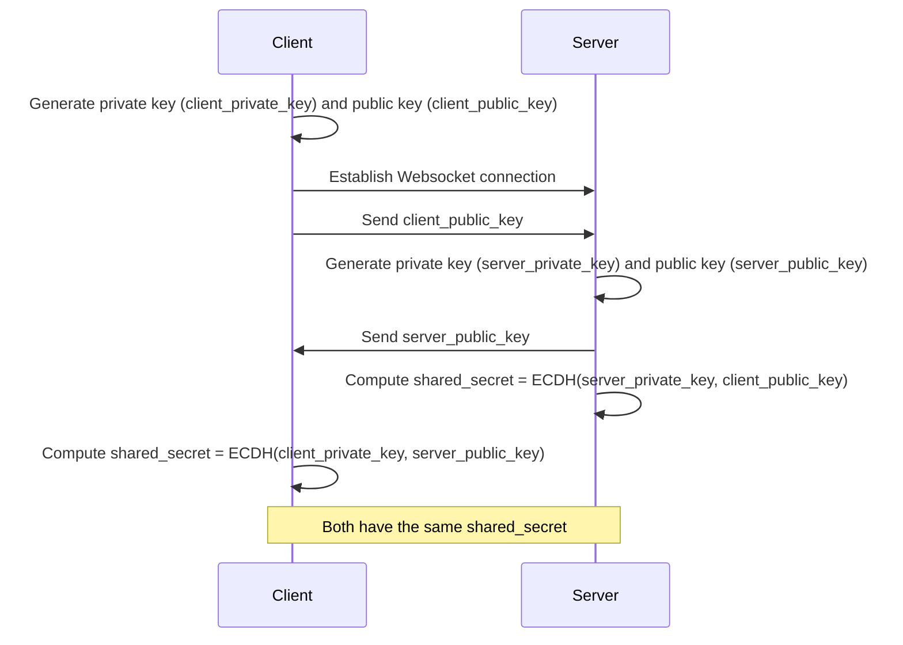

# backend-rust

Implementation of KAS from [OpenTDF specification](https://github.com/opentdf/spec)

## Features

- **Key Agreement**: Establish secure shared secrets using ECDH.
- **NanoTDF Rewrap**: Encrypt and rewrap keys using established shared secrets.
- **WebSocket Communication**: Handle encryption and rewrap requests over WebSocket.

## Getting Started

### Prerequisites

- Rust (latest stable version)
- `cargo` package manager
- NATS
- Redis

```bash
brew install nats-server redis flatbuffers
```

### Compile Flatbuffers (optional)

```shell
flatc --binary --rust idl/event.fbs
flatc --binary --rust idl/entity.fbs
flatc --binary --rust idl/metadata.fbs
```

### Installation

1. Build the project to download and compile the dependencies:

   ```shell
   cargo build
   ```

   Release build

   ```shell
   export RUSTFLAGS="-C target-cpu=native"
   cargo build --release
   ```

### Running the Server

1. Ensure you have a valid EC private key in PEM format named `recipient_private_key.pem`.

   ```shell
   openssl ecparam -genkey -name prime256v1 -noout -out recipient_private_key.pem
   ```

   Validate
   ```shell
   openssl ec -in recipient_private_key.pem -text -noout
   ```

2. Ensure you have a valid EC private key in PEM format named `recipient_private_key.pem`.

   ```shell
   openssl ecparam -genkey -name prime256v1 -noout -out recipient_private_key.pem
   ```

   Validate
   ```shell
   openssl ec -in recipient_private_key.pem -text -noout
   ```

3. Generating Self-Signed Certificate

For development purposes, you can generate a self-signed certificate using OpenSSL. Run the following command in your
terminal:

```bash
openssl req -x509 -newkey rsa:4096 -keyout privkey.pem -out fullchain.pem -days 365 -nodes -subj "/CN=localhost"
```

This command will generate two files in your current directory:

- `privkey.pem`: The private key file
- `fullchain.pem`: The self-signed certificate file

Note: Self-signed certificates should only be used for development and testing. For production environments, use a
certificate from a trusted Certificate Authority.

#### Configuration

The server can be configured using environment variables. If not set, default values will be used.

| Environment Variable | Description                              | Default Value               |
|----------------------|------------------------------------------|-----------------------------|
| PORT                 | The port on which the server will listen | 8080                        |
| TLS_CERT_PATH        | Path to the TLS certificate file         | ./fullchain.pem             |
| TLS_KEY_PATH         | Path to the TLS private key file         | ./privkey.pem               |
| KAS_KEY_PATH         | Path to the KAS private key file         | ./recipient_private_key.pem |
| JWT_VALIDATION_DISABLED | Disable JWT signature validation (dev only) | true                        |
| JWT_PUBLIC_KEY_PATH  | Path to JWT public key (if validation enabled) | -                           |
| NATS_URL             | URL for NATS connection                  | nats://localhost:4222       |
| NATS_SUBJECT         | Default NATS subscription subject        | nanotdf.messages            |
| REDIS_URL            | URL for Redis connection                 | redis://localhost:6379      |
| ENABLE_TIMING_LOGS   | Enable performance timing logs           | false                       |
| RUST_LOG             | Rust logging level                       | -                           |

All file paths are relative to the current working directory where the server is run.

**Security Note:** For production deployments, set `JWT_VALIDATION_DISABLED=false` and provide a public key via `JWT_PUBLIC_KEY_PATH` to enable proper JWT signature verification.

```env
export PORT=8443
export TLS_CERT_PATH=/path/to/fullchain.pem
export TLS_KEY_PATH=/path/to/privkey.pem
export KAS_KEY_PATH=/path/to/recipient_private_key.pem
export JWT_VALIDATION_DISABLED=false
export JWT_PUBLIC_KEY_PATH=/path/to/jwt_public_key.pem
export NATS_URL=nats://localhost:4222
export NATS_SUBJECT=nanotdf.messages
export REDIS_URL=redis://localhost:6379
export AWS_ACCESS_KEY_ID=your_access_key
export AWS_SECRET_ACCESS_KEY=your_secret_key
export AWS_REGION=your_region
export S3_BUCKET=your_bucket_name
export ENABLE_TIMING_LOGS=true
export RUST_LOG=info
```

(Optional) Set the environment variables if you want to override the defaults.

##### Security Note

Remember to keep your private keys secure and never commit them to version control systems. It's recommended to use
environment variables or secure vaults for managing sensitive information in production environments.

#### Start internal services

```shell
nats-server
```

```shell
redis-server
```

#### Start backend

```shell
cargo run
```

The server will start and listen on the configured port.

### Usage

- **Key Agreement**: The server establishes a shared secret with each client using ECDH.
- **NanoTDF Rewrap**: Clients can send rewrap requests to securely re-encrypt keys with a new shared secret.

**For detailed protocol specification**, see [PROTOCOL.md](PROTOCOL.md) which documents:
- Custom binary WebSocket protocol
- Message format and types
- Authentication and security
- Comparison with standard OpenTDF REST API
- Testing recommendations for OpenTDF interoperability

## Automated Testing

### Unit Tests

Run unit tests with:

```shell
cargo test --lib
```

### Integration Tests

Integration tests verify functionality with external services like S3, Redis, and NATS. They can run:

1. **Locally** with real AWS credentials:

```shell
# S3 integration tests
export AWS_ACCESS_KEY_ID=your_access_key
export AWS_SECRET_ACCESS_KEY=your_secret_key
export AWS_REGION=your_region
export TEST_S3_BUCKET=your_test_bucket
cargo test --test s3_integration_test
cargo test --test event_storage_integration_test
```

2. **In CI** with LocalStack (simulated AWS services):

The project includes GitHub Actions workflow in `.github/workflows/integration-tests.yml` that uses:

- LocalStack for S3 testing (no real AWS credentials needed)
- Redis container for Redis testing
- NATS container for NATS testing

### GitHub Actions Workflow

Our CI/CD pipeline automatically runs integration tests on pull requests and commits to main:

1. Sets up runtime dependencies (Redis, NATS, LocalStack)
2. Configures LocalStack to work as a drop-in S3 replacement
3. Generates test certificates and keys
4. Runs all tests including integration tests

To view test results, check the "Actions" tab in GitHub.

## Diagrams

### Key Agreement

