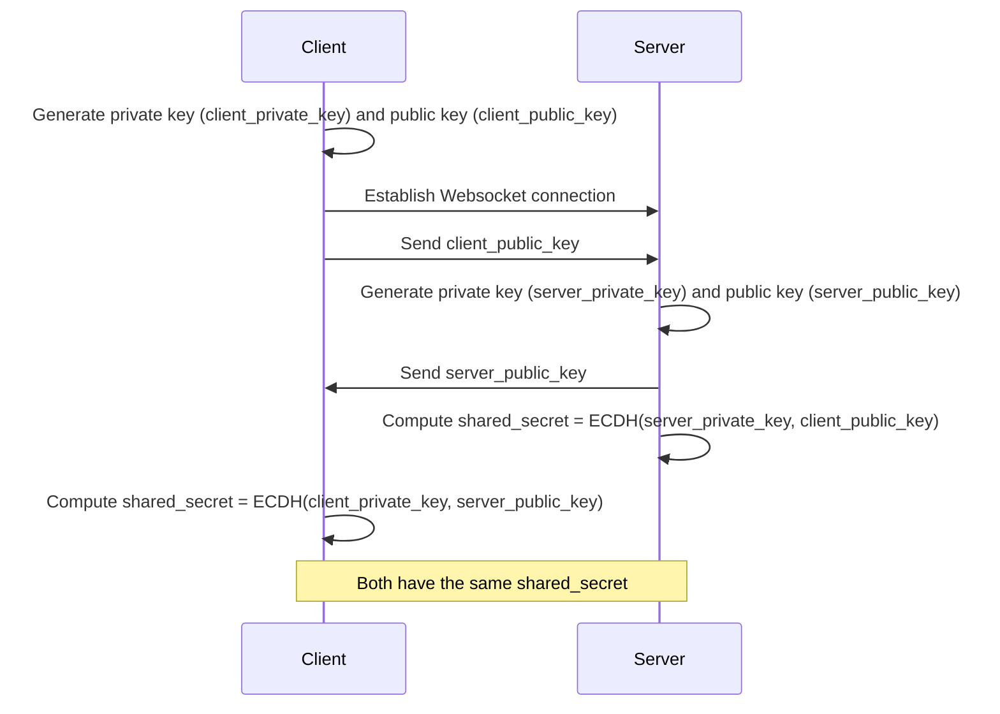

# backend-rust

Implementation of KAS from [OpenTDF specification](https://github.com/opentdf/spec)

## Features

- **Key Agreement**: Establish secure shared secrets using ECDH.
- **NanoTDF Rewrap**: Encrypt and rewrap keys using established shared secrets.
- **WebSocket Communication**: Handle encryption and rewrap requests over WebSocket.

## Getting Started

### Prerequisites

- Rust (latest stable version)
- `cargo` package manager
- NATS
- Redis

```bash
brew install nats-server redis flatbuffers
```

### Compile Flatbuffers (optional)

```shell
flatc --binary --rust idl/event.fbs
```

### Installation

1. Clone the repository:

   ```shell
   git clone https://github.com/arkavo-org/backend-rust.git
   cd backend-rust
   ```

2. Build the project to download and compile the dependencies:

   ```shell
   cargo build
   ```

   Release build

   ```shell
   export RUSTFLAGS="-C target-cpu=native"
   cargo build --release
   ```

### Running the Server

1. Ensure you have a valid EC private key in PEM format named `recipient_private_key.pem`.

   ```shell
   openssl ecparam -genkey -name prime256v1 -noout -out recipient_private_key.pem
   ```

   Validate
   ```shell
   openssl ec -in recipient_private_key.pem -text -noout
   ```

2. Generating Self-Signed Certificate

For development purposes, you can generate a self-signed certificate using OpenSSL. Run the following command in your
terminal:

```bash
openssl req -x509 -newkey rsa:4096 -keyout privkey.pem -out fullchain.pem -days 365 -nodes -subj "/CN=localhost"
```

This command will generate two files in your current directory:

- `privkey.pem`: The private key file
- `fullchain.pem`: The self-signed certificate file

Note: Self-signed certificates should only be used for development and testing. For production environments, use a
certificate from a trusted Certificate Authority.

#### Configuration

The server can be configured using environment variables. If not set, default values will be used.

| Environment Variable | Description                              | Default Value               |
|----------------------|------------------------------------------|-----------------------------|
| PORT                 | The port on which the server will listen | 8443                        |
| TLS_CERT_PATH        | Path to the TLS certificate file         | ./fullchain.pem             |
| TLS_KEY_PATH         | Path to the TLS private key file         | ./privkey.pem               |
| KAS_KEY_PATH         | Path to the KAS private key file         | ./recipient_private_key.pem |
| REDIS_URL            | URL for Redis connection                 | redis://localhost:6379      |

All file paths are relative to the current working directory where the server is run.

```env
export PORT=8443
export TLS_CERT_PATH=/path/to/fullchain.pem
export TLS_KEY_PATH=/path/to/privkey.pem
export KAS_KEY_PATH=/path/to/recipient_private_key.pem
export NATS_URL=nats://localhost:4222
export REDIS_URL=redis://localhost:6379
export ENABLE_TIMING_LOGS=true
export RUST_LOG=info
```

(Optional) Set the environment variables if you want to override the defaults.

##### Security Note

Remember to keep your private keys secure and never commit them to version control systems. It's recommended to use
environment variables or secure vaults for managing sensitive information in production environments.

#### Start internal services

```shell
nats-server
```

```shell
redis-server
```

#### Start backend

```shell
cargo run
```

The server will start and listen on the configured port.

### Usage

- **Key Agreement**: The server establishes a shared secret with each client using ECDH.
- **NanoTDF Rewrap**: Clients can send rewrap requests to securely re-encrypt keys with a new shared secret.

## Diagrams

### Key Agreement

