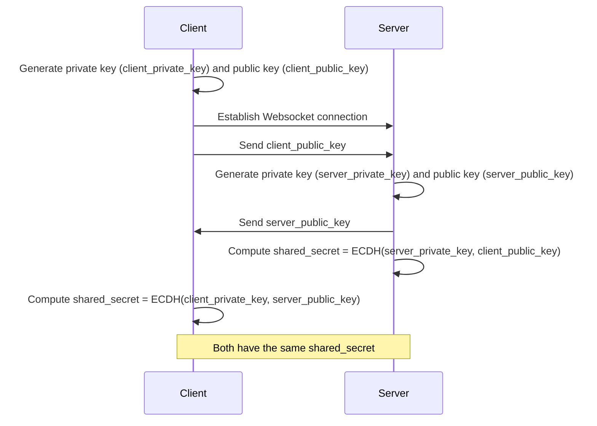

# backend-rust

Implementation of KAS from [OpenTDF specification](https://github.com/opentdf/spec)

## Features

- **Key Agreement**: Establish secure shared secrets using ECDH.
- **NanoTDF Rewrap**: Encrypt and rewrap keys using established shared secrets.
- **WebSocket Communication**: Handle encryption and rewrap requests over WebSocket.

## Getting Started

### Prerequisites

- Rust (latest stable version)
- `cargo` package manager

### Installation

1. Clone the repository:

```shell
git clone https://github.com/arkavo-org/backend-rust.git
cd backend-rust
```

2. Build the project to download and compile the dependencies:

```shell
cargo build
```

### Running the Server

1. Ensure you have a valid EC private key in PEM format named `recipient_private_key.pem`.

    ```shell
    openssl ec -in recipient_private_key.pem -text -noout
    ```

    ```shell
   openssl ecparam -name prime256v1 -genkey -noout -out kas_private_key.pem
    ```

2. Start the server:

    ```shell
    cargo run
    ```

### Usage

- **Key Agreement**: The server establishes a shared secret with each client using ECDH.
- **NanoTDF Rewrap**: Clients can send rewrap requests to securely re-encrypt keys with a new shared secret.

## Diagrams

### Key Agreement


